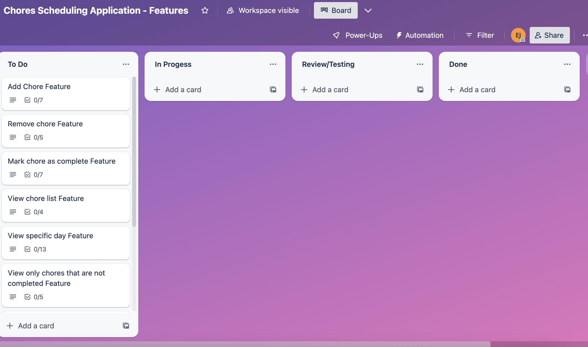
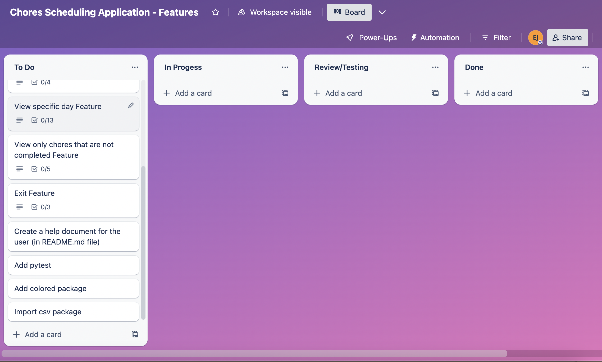
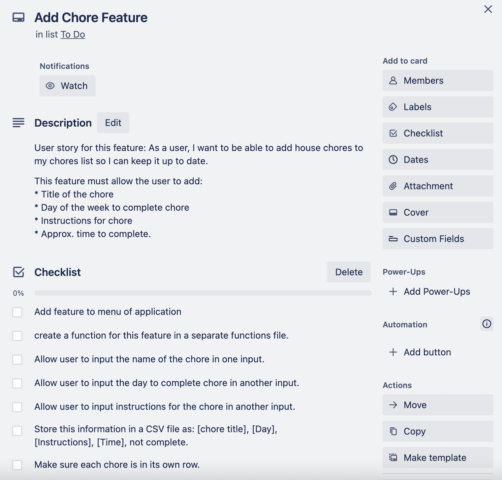

# Ella Jones - Term 1, Assessment 3 - Terminal Application

## Link to GitHub Repository
https://github.com/ella-jones/T1A3_TerminalApp.git

## Style Guide
I will be following the Pep8 Python Style Guide while coding my application. 

### Reference for Style Guide:
Van Rossum, G., Warsaw, B., & Coghlan, N. 2001, *PEP 8 - Style guide for Python code*, PEPS Python, accessed 1 May 2023, https://peps.python.org/pep-0008/. 

## Features

### Add chore
This feature will allow the user to add a chore to their chore schedule. I will allow them to enter the following details about the chore:
* Title of the chore
* Day of the week to complete chore (e.g. putting the bins out could only be done on a Sunday, but other chores might be more flexible).
* Instructions for chore (e.g. if it is cleaning the bathroom, the instructions could be which products to use).
* Approx. time to complete. (e.g. putting the bins out might take 5 minutes, but cleaning the bathroom could take 1 hour.

### Remove chore
This will allow the user to remove any chores from the list that they no longer want there.

### Mark chore as complete
This will allow the user to mark a chore as "completed" or "not completed", so they know what they still have to do for that week.

### View list of chores
This will allow the user to view a list of their current chores and see what they have/haven't completed.

### View chores for a specific day.
This will allow the user to select a specific day of the week and view all chores that need to be completed on that day.

### View non-completed chores
This will allows the user to view all chores that have not been marked as complete, without having to sort through the entire chores list.

### Exit
This will allow the user to exit from the application.

## Implementation Plan

I have used a Trello board to manage my implementation plan. I have created each feature as a seperate card in the to do section. I have also included other tasks that needed to be completed in the todo section, such as "Add Pytest package". See screenshots below:

In each of the cards, I have included a user story for each feature, as well as a checklist for tasks to complete within each feature and a due date for the completion of that feature. See screenshot example below. To view each individual card, please visit the Trello board link (below).

When I begin working on a feature, I will move it to the "in progess" section on the board. When I begin testing on that feature, I will move it to the "review/testing" section, and when the feature is complete I will move the card to the "done" section.

### Link to Trello Board:
https://trello.com/invite/b/uzTcGk2q/ATTI610309933774f13c1f83c3cae6183f419CDB02E9/chores-scheduling-application-features.

## Help Documentation