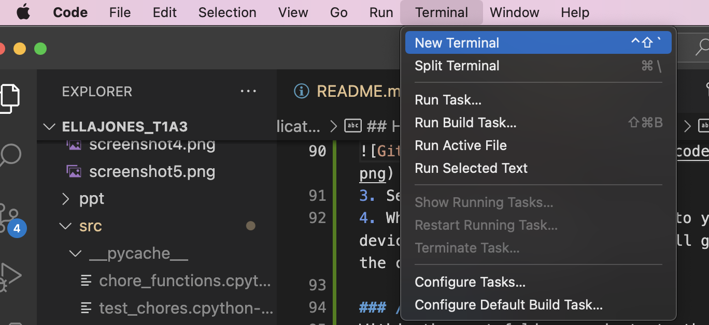

# **Ella Jones - Term 1, Assessment 3 - Terminal Application**

## **Link to GitHub Repository**
https://github.com/ella-jones/T1A3_TerminalApp.git

## **Style Guide**
I will be following the Pep8 Python Style Guide while coding my application. 

### Reference for Style Guide:
Van Rossum, G., Warsaw, B., & Coghlan, N. 2001, *PEP 8 - Style guide for Python code*, PEPS Python, accessed 1 May 2023, https://peps.python.org/pep-0008/. 

## **About**
Chores List is an application that allows users to keep track of chores that they need to complete each week. It allows them to assign a specific day to each chore, add new chores, remove old chores, mark chores as complete and view the chores (by day, by uncompleted, or all chores).

## **Features**

### **Menu Bar**
This feature will be the first thing that the user sees. It will display the features for the program and allow them to select their choice. The menu bar include the below options:
* Add chore
* Remove chore
* Mark chore as complete
* View chore list
* View a specific day's chores
* View all uncompleted chores

### **Add chore**
This feature will allow the user to add a chore to their chore schedule. I will allow them to enter the following details about the chore:
* Title of the chore
* Day of the week to complete chore (e.g. putting the bins out could only be done on a Sunday, but other chores might be more flexible).
* Instructions for chore (e.g. if it is cleaning the bathroom, the instructions could be which products to use).
* Approx. time to complete. (e.g. putting the bins out might take 5 minutes, but cleaning the bathroom could take 1 hour.

### **Remove chore**
This will allow the user to remove any chores from the list that they no longer want there.


### **Mark chore as complete**
This will allow the user to mark a chore as "completed", so they know what they still have to do for that week.


### **View list of chores**
This will allow the user to view a list of their current chores and see what they have/haven't completed.


### **View chores for a specific day**
This will allow the user to select a specific day of the week and view all chores that need to be completed on that day.

### **View non-completed chores**
This will allows the user to view all chores that have not been marked as completed, without having to sort through the entire chores list.

### **Exit**
This will allow the user to exit from the application.

<br>

## **Implementation Plan**

I have used a Trello board to manage my implementation plan. I have created each feature as a seperate card in the to do section. See screenshot below:


In each of the cards, I have included a user story for each feature, as well as a checklist for tasks to complete within each feature and a due date for the completion of that feature. See screenshot example below. To view each individual card, please visit the Trello board link (below).


When I begin working on a feature, I will move it to the "in progess" section on the board. When I begin testing on that feature, I will move it to the "review/testing" section, and when the feature is complete I will move the card to the "done" section.

### Link to Trello Board:
https://trello.com/b/uzTcGk2q/chores-scheduling-application-features. 

## **Help Documentation**

### **VS Code**
This program works best when run in the VS Code application. For information regarding VS Code installation, click [HERE](https://code.visualstudio.com/download).

### **Python**
Install Python: Python is usually installed by default on most modern systems. To check what version you currently have, open a terminal and run the following command:

```
python3 --version
```

It is important that Python version 3.4 or later is installed. To install Python3 , click [HERE](https://www.python.org/downloads/).

### **Install Application**
To install this application, you will need to clone or download this repo. Please find instructions for both methods below:

### *Cloning*
For instructions on how to clone a GitHub repository, click [HERE](https://docs.github.com/en/repositories/creating-and-managing-repositories/cloning-a-repository).

### *Downloading*
To download a GitHub repository: 
1. Navigate to the main page of the repository in GitHub. 
2. Above the list of files, click  "<>Code".

3. Select "Download ZIP"
4. When this folder has downloaded to your device, open the folder and this will generate the content of the folder. 

### **/src Folder**
Within the root folder, navigate to the /src folder and open this in VS Code.

### **Terminal Window**
Once in VS Code, open a new terminal:
1. Up the top of your screen, click "Terminal" > "New Terminal"."



### **Run Application**
In the terminal, write the command:
```
$ ./run_setup.sh
```
This will run the program.

### **Have a Play**
 Follow the application's instructions in the terminal to interact with and edit your chore list!